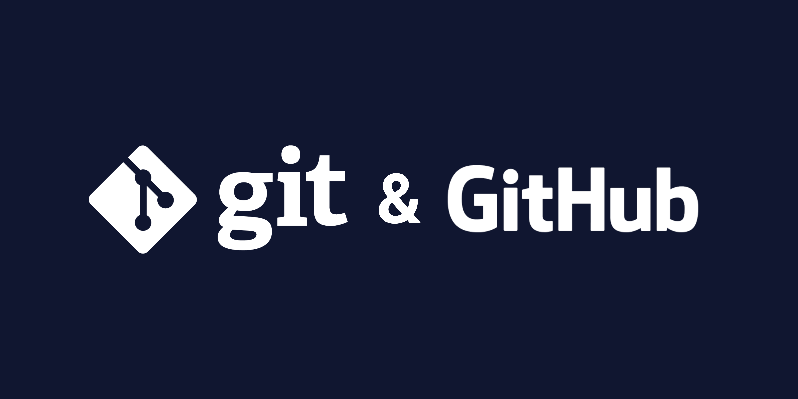

# Introduction to Git - GitHub

<p  align="center">



</p>

## What is Version Control?

Version control is a system that records changes to a file or set of files over time so that you can recall specific versions later. It allows you to revert selected files back to a previous state, revert the entire project back to a previous state, compare changes over time, see who last modified something that might be causing a problem, who introduced an issue and when, and more.

### Distributed Version Control Systems

<p  align="center">


</p>

In a DVCS (such as Git, Mercurial or Darcs), clients don’t just check out the latest snapshot of the files; rather, they fully mirror the repository, including its full history. Thus, if any server dies, and these systems were collaborating via that server, any of the client repositories can be copied back up to the server to restore it. Every clone is really a full backup of all the data.

Furthermore, many of these systems deal pretty well with having several remote repositories they can work with, so you can collaborate with different groups of people in different ways simultaneously within the same project.

## What Is Git?

Git is a distributed, free and open-source (GPLv2) version control system (VCS) that enables you to store code, track revision history, merge code changes, and revert to earlier code version when needed.

The Linux kernel is an open source software project of fairly large scope. During the early years of the Linux kernel maintenance (1991–2002), changes to the software were passed around as patches and archived files. In 2002, the Linux kernel project began using a proprietary DVCS called BitKeeper.

In 2005, the relationship between the community that developed the Linux kernel and the commercial company that developed BitKeeper broke down, and the tool’s free-of-charge status was revoked. This prompted the Linux development community (and in particular Linus Torvalds, the creator of Linux) to develop their own tool based on some of the lessons they learned while using BitKeeper and Monotone. Since 2005, Junio Hamano has been the core maintainer. Some of the goals of the new system were as follows:

- Speed
- Simple design
- Strong support for non-linear development (thousands of parallel branches)
- Fully distributed
- Able to handle large projects like the Linux kernel efficiently (speed and data size)

Since its birth in 2005, Git has evolved and matured to be easy to use and yet retain these initial qualities. It’s amazingly fast, it’s very efficient with large projects, and it has an incredible branching system for non-linear development.

### What Are the Benefits of Git?

- **``Historical Change Tracking``** – You can review a graph of how your commits have changed over time, see when and by whom changes were made, and revert to a previous commit if needed. This history makes it easier to identify and fix bugs.

- **``Work as a Team``** – You can easily share your code with teammates for review before you commit or merge back to the main working branch. Additionally, the branching and review capabilities enable simultaneous development. Multiple people can work on the same file and resolve differences later.

- **``Improve Team Speed & Productivity``** – Git makes it easy for your team to track changes to your code. Now, you can focus on writing code instead of spending time tracking and merging different versions across your team. Additionally, Git performs computations and stores your main repository locally, making it quicker on most operations than a centralized VCS.

- **``Availability``** – Git is a distributed VCS, meaning there is no single, central place where everything is stored. In a distributed system, there are multiple backups in the event that you need one. This approach also means that you can work offline and commit your changes when you’re ready.

- **``Industry Standard``** – Due to its popularity, Git is supported by many integrated development environments (IDEs) and many popular developer tools.

## Git Installation

We can [install Git](https://git-scm.com/downloads) on the most common operating systems like Windows, Mac, and Linux.

To see if we already have Git installed, let’s open up a terminal and execute the command bellow.

```
$ git --version
git version 2.34.1
```

## git help – Manual

If you ever need help while using Git, there are three equivalent ways to get the comprehensive manual page (manpage) help for any of the Git commands.

```
$ git help

usage: git [--version] [--help] [-C <path>] [-c <name>=<value>]
[--exec-path[=<path>]] [--html-path] [--man-path] [--info-path]
[-p | --paginate | -P | --no-pager] [--no-replace-objects] [--bare]
[--git-dir=<path>] [--work-tree=<path>] [--namespace=<name>]
[--super-prefix=<path>] [--config-env=<name>=<envvar>]
<command> [<args>]

...
```

We can also check the manual for a specific command in multiple ways.

```
$ git --help <command>
$ git help <command>
$ git <command> --help
```

In addition, if you don’t need the full-blown manpage, but just need a quick help, you can use **``-h``** option for the more concise “help” output.

```
$ git <command> -h
```

## Configuring Git

Now that you have Git on your system, you need to do a few things to customize your Git environment. You should have to do these things only once on any given computer; they’ll stick around between upgrades. You can also change them at any time by running through the commands again.

Git comes with a tool called **``git config``** that lets you get and set configuration variables.

Git supports options at different levels: system, global, local. These levels allow you to define configuration settings at different scopes, affecting either the entire system, a specific user, or a particular repository.

- **``system:``** Applies to all users on the system and all repositories.
- **``global:``** Applies to a specific user across all repositories.
- **``local:``** Applies only to a specific repository.

Git resolves the effective value of an option by checking the local level first and then goes until the system level if the option isn’t set.

```
$ git config --global user.name "Barış Dalyan Emre"
$ git config --global user.email "barisdalyane@gmail.com"
```

Each level overrides values in the previous level, to override an option for a single repository, we can use the **`--local`** option in its directory.

To enable helpful colorization of command line output.

```
$ git config --global color.ui auto
```

To print the list of effective options.

```
$ git config -l
```

## Creating a Repository

We have two alternatives, a new repository can be either created locally from scratch or an existing one can be cloned.

### git clone – Clone an External Repository

The **``git clone``** command clones the repository into a new directory.

When it finishes, the new directory created contains all the project’s files, branches, and history.

```
$ git clone git@github.com:barisdalyan/introduction-to-git-github.git
Cloning into 'introduction-to-git-github'...
```

>  **Important:** We need to delete **`.git`** hidden directory, **``app.post``**,**``app.put``** and **``app.delete``** endpoints in **``node-blog-app-server/app/app.js``** file to create a new local repository that we are going to use to practice.

### git init – Initialize a New Repository

If we decide to initialize a new repository, we need to use the **``git init``** command. It turns the current directory into a Git repository and starts tracking its content. Git also creates a hidden directory called **`.git`** in it. This directory stores all the objects and refs that Git creates and uses as part of our project’s history. Those files are created during commits and point to specific revisions of our files.

```
$ git init
Initialized empty Git repository in /introduction-to-git-github/.git/
```

## Git Workflow

<p  align="center">


</p>

Git thinks of its data more like a series of snapshots of a miniature filesystem. With Git, every time you commit, or save the state of your project, Git basically takes a picture of what all your files look like at that moment and stores a reference to that snapshot. To be efficient, if files have not changed, Git doesn’t store the file again, just a link to the previous identical file it has already stored. Git thinks about its data more like a stream of snapshots.

Git has three main states that your files can reside in: **modified**, **staged**, and **committed**:

- Modified means that you have changed the file but have not committed it to your local git repository yet.
- Staged means that you have marked a modified file in its current version to go into your next commit snapshot.
- Committed means that the data is safely stored in your local git repository.

This leads us to the three main sections of a Git project: the **working directory**, the **staging area (index)**, and the **Git directory (local repository)**.

<p  align="center">


</p>

The basic Git workflow goes something like this:

- You modify files in your working directory.
- You stage just those changes you want to be part of your next commit, which adds only those changes to the staging area.
- You do a commit, which takes the files as they are in the staging area and stores that snapshot permanently to your Git directory.

If a particular version of a file is in the Git directory, it’s considered **committed**. If it has been modified and was added to the staging area, it is **staged** and if it was changed since last commit but it has not been staged, it is **modified**.
  
## Making Changes on the Project

<p  align="center">


</p>

### git status – Show Current Changes

This command prints the current detailed status of our changes.

```
$ git status
On branch master


No commits yet

  
Untracked files:
(use "git add <file>..." to include in what will be committed)
.dockerignore
.gitignore
Dockerfile
app/
docker-compose.yml

  
nothing added to commit but untracked files present (use "git add" to track)
```

### git add – Track the Changes

To start tracking the changes, we need to move them to the Index by using the **`git add`** command. We can specify multiple files at once by separating them with a space.

```
$ git add docker-compose.yml
```

We can also add all files to staging area.

```
$ git add . or git add * or git add -A
```

Let’s verify the status.

```
$ git status
On branch master


No commits yet

  
Changes to be committed:
(use "git rm --cached <file>..." to unstage)
new file: .dockerignore
new file: .gitignore
new file: Dockerfile
new file: app/.env
new file: app/app.js
new file: app/models/blogPost.js
new file: app/package-lock.json
new file: app/package.json
new file: docker-compose.yml
```

### git commit – Save the Changes

Git considers each commit a **``snapshot``** or **``save point``** of our repository at a specific time. It is a point in the project you can go back to if you find a bug, or want to make a change.

```
$ git commit -m "initial commit"
[master (root-commit) 7b28d85] initial commit
9 files changed, 1653 insertions(+)
create mode 100644 .dockerignore
create mode 100644 .gitignore
create mode 100644 Dockerfile
create mode 100644 app/.env
create mode 100644 app/app.js
create mode 100644 app/models/blogPost.js
create mode 100644 app/package-lock.json
create mode 100644 app/package.json
create mode 100644 docker-compose.yml
```

**``-m``** option, which specifies a commit message describing changes done in the current snapshot.

Let’s check the status.

```
$ git status
On branch master
nothing to commit, working tree clean
```

### git log and git show – Inspect Commits

We use the **``git log``** command to print the history of commits of the current branch in reverse chronological order by default. Each entry contains the general metadata like the commit’s id (a unique SHA-1 checksum), author, date, and given message.

```
$ git log

commit 7b28d8584ca7efa4dfa885fcd8eddb8da8565424 (HEAD -> master)
Author: Barış Dalyan Emre <barisdalyane@gmail.com>
Date: Sat Dec 23 02:36:44 2023 +0300

  
initial commit
```

When we want to go deeper into a single commit, we print its details using the **``git show``** command followed by the requested commit id. The output also displays the differences done by the commit versus the previous snapshot using the **``git diff``** command.

Useful sources to write better commit messages:

- [Apurva Jain - Writing Better Commit Messages](https://medium.com/swlh/writing-better-commit-messages-9b0b6ff60c67)

- [joelparkerhenderson - git-commit-message](https://github.com/joelparkerhenderson/git-commit-message)

### git reset and gitignore – Untrack the Changes

If we moved a file changes into staging area by mistake, we can unstage it while retaining the changes in working directory.

```
$ git reset docker-compose.yml

$ git status
On branch master


No commits yet


Changes to be committed:
(use "git rm --cached <file>..." to unstage)
new file: .dockerignore
new file: .gitignore
new file: Dockerfile
new file: app/.env
new file: app/app.js
new file: app/models/blogPost.js
new file: app/package-lock.json
new file: app/package.json


Untracked files:
(use "git add <file>..." to include in what will be committed)

docker-compose.yml
```

We can also unstage all files using dot sign.

```
$ git reset .
```

The command below represents the default mode for **``git reset``**. It will move the HEAD and branch pointer to the specified commit (in this case, the parent of the current commit, HEAD~). It will also unstage the changes, effectively moving them from the staging area back into the working directory. However, the changes themselves will remain in the working directory as uncommitted changes. This mode is often used when you want to unstage changes but keep them in your working directory for further modifications before committing.

```
$ git reset --mixed HEAD~
```

The command below moves the HEAD and branch pointer to the specified commit but leaves the changes staged. This means the changes are not moved back to the working directory, and they are still ready to be included in the next commit. It's commonly used when you want to "uncommit" the last commit but keep the changes for further modification before creating a new commit.

```
$ git reset --soft HEAD~
```

If you want to discard the changes as well, you can use **``--hard``**. Be careful, as it discards changes in your working directory, and those changes will be unrecoverable.

```
$ git reset --hard HEAD~
```
  
We can also permanently exclude files and disable tracking them. To do this, we need to create a **``.gitignore``** file. This file contains filename patterns and is applied to all the files in the current directory and its child directories. Any further add actions will ignore files matching those patterns.

Useful sources for .gitignore file:

- [git-scm.com](https://git-scm.com/docs/gitignore)

- [atlassian.com](https://www.atlassian.com/git/tutorials/saving-changes/gitignore)

- [gitignore.io](https://www.toptal.com/developers/gitignore)

- [A collection of useful .gitignore templates.](https://github.com/github/gitignore)

## Branching and Merging

Branches are used to develop features isolated from each other. We use other branches for development and merge them back to the master branch upon completion. The default branch name in Git is **``master``**. As you start making commits, you’re given a master branch that points to the last commit you made. Every time you commit, the master branch pointer moves forward automatically.

### git branch

The **``git branch``** helps us manage branches. We can use it to create a new branch.

```
$ git branch post-endpoint-feature-branch
```

We can use **``-a``** option to list both local and remote branches.

```
$ git branch -a
* master
post-endpoint-feature-branch
```

We can use **``-d``** option to delete a local branch.

```
$ git branch -d post-endpoint-feature-branch
Deleted branch post-endpoint-feature-branch (was 7b28d85).
```

### git checkout

If we want to switch current branch, we use the **``git checkout``** command.

```
$ git checkout post-endpoint-feature-branch
Switched to branch 'post-endpoint-feature-branch'

  
$ git branch -a
master
* post-endpoint-feature-branch
```

We can also create and switch current branch using **``-b``** option. Otherwise the command just create a new branch and maintains its current branch state.

```
$ git checkout -
Switched to branch 'master'


$ git checkout -b put-endpoint-feature-branch
Switched to a new branch 'put-endpoint-feature-branch'


$ git branch -a
master
post-endpoint-feature-branch
* put-endpoint-feature-branch
```

If we have made changes to tracked files and we need to discard changes to last commit, we can use **``git checkout -- . [all files or file name]``** command.

```
$ git status
On branch master
Changes not staged for commit:
(use "git add <file>..." to update what will be committed)
(use "git restore <file>..." to discard changes in working directory)


modified: app/app.js

  
no changes added to commit (use "git add" and/or "git commit -a")

  
$ git checkout -- app/app.js

  
$ git status
On branch master
nothing to commit, working tree clean
```

If we want to switch current commit version (snapshot) to a specific commit version, we can use the **``git checkout``** command. Before doing that, let's add the code below to **``app.js``** file while we are on master branch.

```
app.delete('/:postId', async (req, res) => {

try {

const postId = req.params.postId;

await BlogPost.findByIdAndDelete(postId);

return res.redirect('/');

} catch (error) {

res.send({

errorMessage: error

});

}

});
```

Then, we need to commit changes.

```
$ git status

On branch master
Changes not staged for commit:
(use "git add <file>..." to update what will be committed)
(use "git restore <file>..." to discard changes in working directory)


modified: app/app.js

  
no changes added to commit (use "git add" and/or "git commit -a")

  
$ git add app/app.js

  
$ git status
On branch master
Changes to be committed:
(use "git restore --staged <file>..." to unstage)
modified: app/app.js
  

$ git log
commit 7b28d8584ca7efa4dfa885fcd8eddb8da8565424 (HEAD -> master, put-endpoint-feature-branch, post-endpoint-feature-branch)
Author: Barış Dalyan Emre <barisdalyane@gmail.com>
Date: Sat Dec 23 02:36:44 2023 +0300


initial commit


$ git commit -m "add delete endpoint function"
[master 8efc515] add delete endpoint function
1 file changed, 12 insertions(+)


$ git log
commit 8efc515665aeed942287fd181b04c22e436370e0 (HEAD -> master)
Author: Barış Dalyan Emre <barisdalyane@gmail.com>
Date: Sat Dec 23 11:25:28 2023 +0300

  
add delete endpoint function
 

commit 7b28d8584ca7efa4dfa885fcd8eddb8da8565424 (put-endpoint-feature-branch, post-endpoint-feature-branch)
Author: Barış Dalyan Emre <barisdalyane@gmail.com>
Date: Sat Dec 23 02:36:44 2023 +0300

  
initial commit
```

Now, we want to switch the current commit to initial commit. **``$ git checkout [commit hash that we want to switch] [file name or . (dot)]``**

```
git checkout 7b28d8584ca7efa4dfa885fcd8eddb8da8565424 app/app.js
```

Check the app/app.js file, the delete endpoint function will be removed. We can use same command to switch to latest commit.

### git diff

After changes made in the repository, it shows the differences between files.

To show the differences between the current state of your working directory and the changes that have been staged (added to the index).

```
$ git diff [file name or . (dot)]
```

To show the differences between the changes that have been staged and the last commit.

```
$ git diff --staged
```

### git merge

We use **``git merge``** command when we want to merge changes from another branch into the branch we are currently on.

Let's merge the post-endpoint-feature-branch with master branch after adding the code below to app.js file and committing changes while we are on post-endpoint-feature-branch.

```
app.post('/', async (req, res) => {

try {

const { title, description, content } = req.body;

const registeredBlogPost = await BlogPost.findOne({ title: title });

if (registeredBlogPost === null) {

await BlogPost.create({

title: title.trim(),

description: description.trim(),

content: content.trim()

});

} else {

console.log('The post already exists!');

}

return res.redirect('/');

} catch (error) {

res.send({

errorMessage: error

});

}

});
```

Then, we need to commit changes.

```
$ git status
On branch post-endpoint-feature-branch
Changes not staged for commit:
(use "git add <file>..." to update what will be committed)
(use "git restore <file>..." to discard changes in working directory)


modified: app/app.js
  

no changes added to commit (use "git add" and/or "git commit -a")

  
$ git add app/app.js


$ git commit -m "add post endpoint function"
[post-endpoint-feature-branch c66a56a] add post endpoint function
1 file changed, 21 insertions(+)

  
$ git status
On branch post-endpoint-feature-branch
nothing to commit, working tree clean

  
$ git log
commit c66a56ac3ac45194655e1c95d07496fdb704ffee (HEAD -> post-endpoint-feature-branch)
Author: Barış Dalyan Emre <barisdalyane@gmail.com>
Date: Sat Dec 23 12:34:34 2023 +0300


add post endpoint function

  
commit 7b28d8584ca7efa4dfa885fcd8eddb8da8565424 (put-endpoint-feature-branch)
Author: Barış Dalyan Emre <barisdalyane@gmail.com>
Date: Sat Dec 23 02:36:44 2023 +0300


initial commit
```

Now, we can merge post-endpoint-feature-branch with master branch.

```
$ git checkout master

  
$ git branch
* master
post-endpoint-feature-branch
put-endpoint-feature-branch

  
$ git merge post-endpoint-feature-branch
Auto-merging app/app.js
CONFLICT (content): Merge conflict in app/app.js
Automatic merge failed; fix conflicts and then commit the result.

  
$ git status
On branch master
You have unmerged paths.
(fix conflicts and run "git commit")
(use "git merge --abort" to abort the merge)
 

Unmerged paths:
(use "git add <file>..." to mark resolution)
both modified: app/app.js

  
no changes added to commit (use "git add" and/or "git commit -a")
```

We had our first **``CONFLICT``** error after merging branches.

The conflict resolution process leaves the files with conflict markers (<<<<<<<, =======, >>>>>>>) in our working directory. After manually resolving these conflicts, we need to tell Git that the conflicts are resolved by staging the changes and creating a new commit.

```
$ git add app/app.js
  
$ git status
On branch master
All conflicts fixed but you are still merging.
(use "git commit" to conclude merge)


Changes to be committed:
modified: app/app.js
  

$ git commit -m "fixed merge conflict between master and post-endpoint-feature-branch"

[master 2860dd9] fixed merge conflict between master and post-endpoint-feature-branch


$ git status
On branch master
nothing to commit, working tree clean  

$ git log

commit 2860dd96a08c800deb5ab9a7b851dfe30e653984 (HEAD -> master)
Merge: 453f053 c66a56a
Author: Barış Dalyan Emre <barisdalyane@gmail.com>
Date: Sat Dec 23 13:04:52 2023 +0300


fixed merge conflict between master and post-endpoint-feature-branch

  
commit c66a56ac3ac45194655e1c95d07496fdb704ffee (post-endpoint-feature-branch)
Author: Barış Dalyan Emre <barisdalyane@gmail.com>
Date: Sat Dec 23 12:34:34 2023 +0300


add post endpoint function


commit 453f053df1e09432fe0387cb61030a574322262f
Author: Barış Dalyan Emre <barisdalyane@gmail.com>
Date: Sat Dec 23 12:28:40 2023 +0300


add delete endpoint function


commit 7b28d8584ca7efa4dfa885fcd8eddb8da8565424
Author: Barış Dalyan Emre <barisdalyane@gmail.com>
Date: Sat Dec 23 02:36:44 2023 +0300

  
initial commit
```

## Synchronizing the Repository

After working locally on the repository till now, it’s finally time to publish our changes.

Before uploading them, we should always synchronize our local copy with the remote to avoid conflicts during publishing.

### git fetch – Update References

While we’re implementing our changes, others may have published changes to the same branch. So we should check and sync them with our local repository.

We use the **``git remote``** command to establish a connection between remote repositories and the local repository.

```
$ git branch -M main

$ git branch
* main
post-endpoint-feature-branch
put-endpoint-feature-branch

$ git remote add origin git@github.com:barisdalyan/introduction-to-git-github.git

$ git remote -v
origin git@github.com:barisdalyan/introduction-to-git-github.git (fetch)
origin git@github.com:barisdalyan/introduction-to-git-github.git (push)
```

**``git fetch``** command used to download objects and refs from another repository. It doesn't merge or modify your working directory, but instead brings in changes from a remote repository to your local repository.

```
$ git fetch origin/main
```

### git pull – Update and Apply

**``git pull``** command checks a given branch for the latest changes and merges them with the current branch, in the same way as git fetch and git merge do. It’s the most common way to update the current branch. Pulling changes might also require an additional manual action to resolve merge conflicts.

```
$ git pull origin/main
```

### git push – Publishing Local Commits

When we synchronize our local repository and fix pending merge conflicts, we are finally ready to publish our commits. We need to choose the remote target and the local branch.

```
git push -u origin main
```

> **``-u``** option is short for --set-upstream. When you use -u followed by a remote name (in this case, "origin") and a branch name (in this case, "main"), Git sets up a tracking relationship between your local branch and the remote branch. This means that in the future, you can simply use git push or git pull without specifying the remote and branch names because Git remembers the tracking information.

## Software Tools and Sources Used in Training

- [Visual Studio Code](https://code.visualstudio.com/)

- [Postman](https://www.postman.com/)

- [Stack Edit](https://stackedit.io/)

- [readme.so](https://readme.so/)

- [About remote repositories](https://docs.github.com/en/get-started/getting-started-with-git/about-remote-repositories)

- [Generating a new SSH key](https://docs.github.com/en/authentication/connecting-to-github-with-ssh/generating-a-new-ssh-key-and-adding-it-to-the-ssh-agent)
